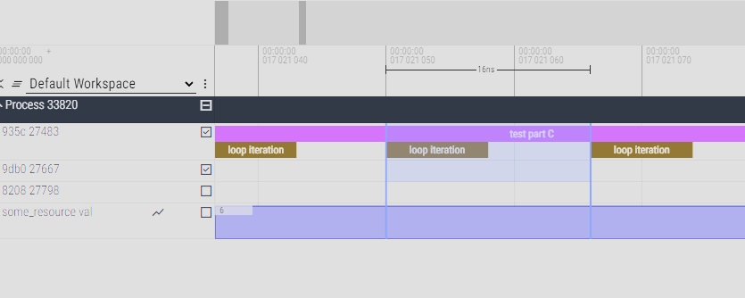
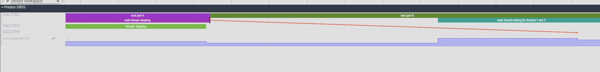

# Low overhead profiler

This repository is an easy-to-integrate profiling (or rather, tracing) engine. It allows you to trace multithreaded applications with low overhead per event generated (usual overhead range per event is 8-12 nanoseconds, you need two events to record a call).

It is very fast compared to other time-tracing mechanisms, but at the expense of not being very portable. Although, it should work fine on Windows 10+ and Ubuntu 20+ OSes and x64 CPU architecture.

It is ideal if you need to profile the execution of a system that has complicated multithreaded structure and that exhibits various phenomena you would want to observe that would be missed by using sampling profilers like VTune or Perf or by using simple time recording mechanisms like std::chrono which induce multiple orders of magnitude more overhead than this project and could result in disturbing the system too much to observe those phenomena. So, if you have got some multithreaded performance related Heisenbug in your code, it could be really helpful.

This code should not be used in a product, it omits various security checks for performance purposes and might result in buffer overflows if it runs for too long due to limited capacity of event tables. Consider this an internal only development tool.

    UPDATE:  
    As of version v0.2, there is additional mode of operation I named "safer" mode. It allows profiler
    to continue to run even if buffers were exhausted and it will flush each exhausted set of buffers
    to separate trace file. You can find details of usage, including limitations, in the profiler.h
    header file.

For more details about motivation, design decisions, usage, overhead causes, limitations, possible recommended tweaks you can make for different use cases, maybe more details about setup, etc.. Feel free to check my [article](https://k-badz.github.io/optimization/low-overhead-profiler/).

## How to setup:

1. Copy the include/profiler.h and src/profiler.cpp directories somewhere into your project
2. Also copy the interesting src/profiler_asm file from the src directory (choose .asm for Windows MASM and .cpp for Linux GCC inline assembly)
3. Setup compilation appropriately to your build engine. You need to enable C++17 in your compiler for these files.
4. Compile and enjoy.

* For linux, compiling example is as simple as this:  
`g++ samples/example.cpp src/profiler_asm.cpp src/profiler.cpp -Wno-format -g -std=c++17 -Iinclude -O2`

* For windows, you need to add the files to solution, enable C++17, enable MASM compiler for asm file, add include directory path, and then build the solution.

## How to use:

1. The interface specified in include/profiler.h is quite self-explanatory, but I added samples directory with practical examples of usage.
2. Put the tracing events in interesting parts of your code.
3. Run the project.
4. Trace file will be generated automatically in your working directory.
5. Open the trace in chrome://tracing or in https://ui.perfetto.dev/

## You liked it? ^^

  

## Samples

## Notice
This is profiler project I designed and implemented during my employment at Intel Corporation. 
At some point it was open sourced under Apache License, Version 2.0 at:  
`https://github.com/HabanaAI/gaudi-pytorch-bridge/blob/v1.20.0/pytorch_helpers/low_overhead_profiler/`  
(disclaimer: version linked above contains also contributions from other engineers and is very project-specific)

As that code contains various Gaudi and Intel -specific parts which makes it hard for other projects to use out of the box, I decided to distill the original idea I had in mind when it was designed.
This repository is the effect of this work, enjoy.

For more details about changes, see NOTICE.txt

## License

This software is distributed under two licenses:
- Original code by Intel Corporation is under the Apache License, Version 2.0
- Modifications by Krzysztof Badziak are under the MIT License

See LICENSE.txt for complete license texts and details.
